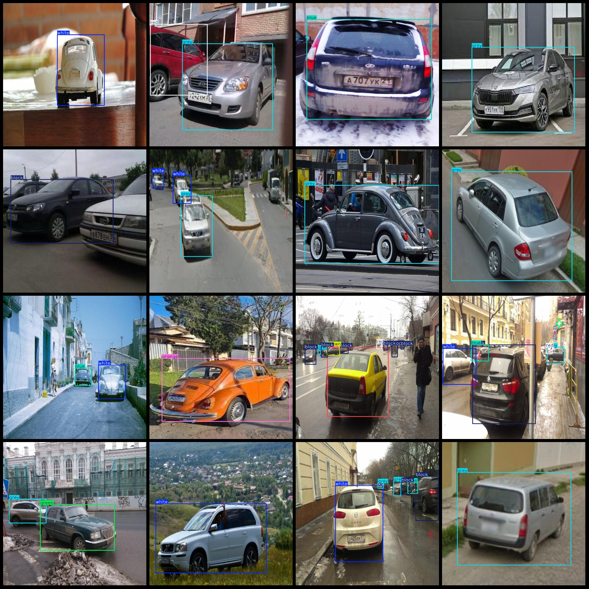
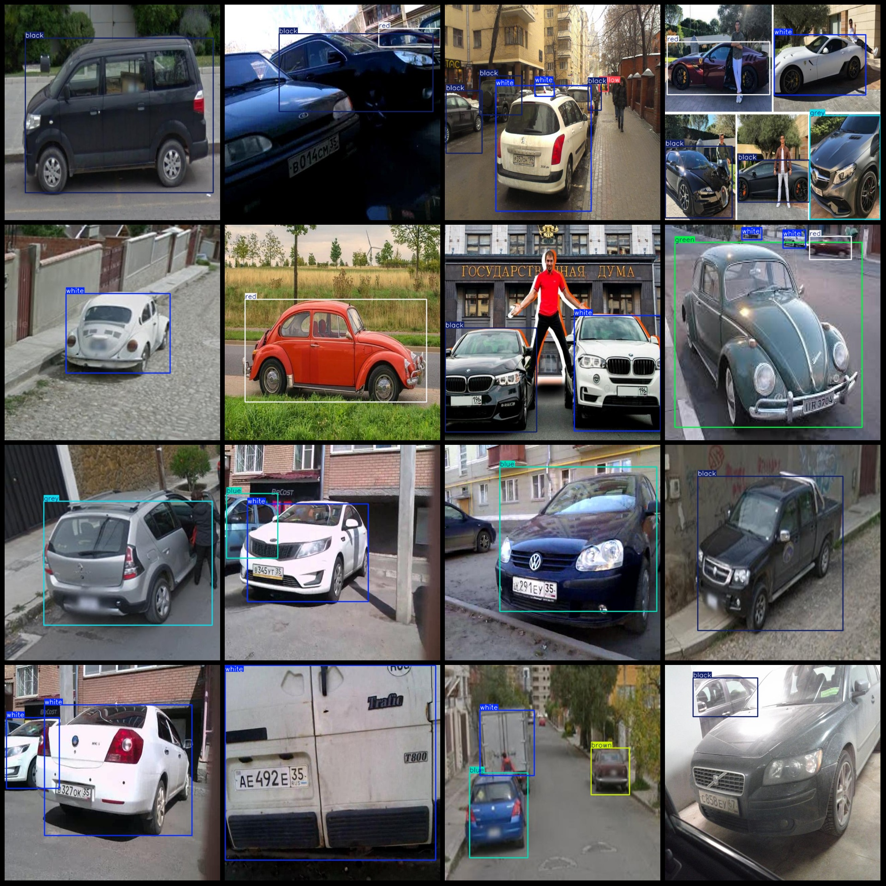

# Intelligent Transportation Vehicle Color Identification and Detection Dataset VOC+YOLO format, 607 images in 9 categories

dataset format: Pascal VOC format+YOLO format(without split path's txt file, only contain jpg picture and corresponding VOC format xml file and yolo format txt file)
number of images: 607  
annotation count: 607  
annotation count: 607  
The number of categories is 9.
The labeled categories are: ["black", "blue", "brown", "green", "grey", "orange", "red", "white", "yellow"]
The number of bounding boxes for each category is:
- black (black) Bounding Boxes = 244
- blue (blue) Bounding Boxes = 151
The number of brown frames is 19.
Green (green) frames = 34
Grey (grey) frames = 172
The number of orange frames is 27.
The number of red frames is 145.
The number of white (white) frames is 262.
The number of yellow frames is 58.
total boxes: 1112  
Image resolution: 640x640
Use annotation tool: labelImg
Annotation rules: Draw a rectangle around the class
Important notes: The dataset does not have a division of training, validation, and test sets; it needs to be manually divided. Note that there are some enhanced images in the dataset.
Special statement: This dataset does not guarantee the accuracy of the trained models or weight files.
Image preview:
## Images

Here is a pay link on Stripe ( https://buy.stripe.com/3cs8yP7sY87d0vu9AB ). Please contact me lonlonago@foxmail.com after funding $89, and I will send you a complete data files , thank you!

